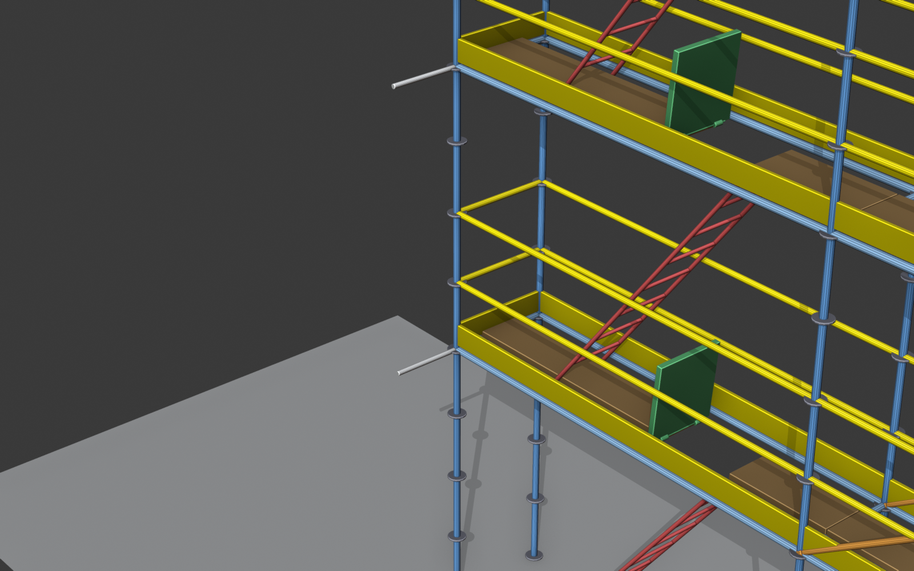

# Andamios — Addon de Blender para diseño y cálculo de andamios paramétricos

> Diseña andamios multidireccional 3D, calcula su resistencia según
> **EN 1993-1-1 + EN 12811-1** y exporta planos CAD profesionales — todo
> dentro de Blender. **De cero a un plano A3 normativo en 5 minutos.**


[](#)
[](#)
[](LICENSE)
[](https://mechanicalpro.vercel.app/andamios)

---

## ¿Qué hace?

A partir de **2 o más empties** que defines en Blender, el addon genera
un andamio paramétrico completo (postes, travesaños, cruces de
arriostramiento, plataformas, escaleras, trampillas, anclajes y rosetas)
que sigue el recorrido de los empties — soporta tramos rectos, en L,
en U y torres cerradas.

Después puedes:
- **Calcular** su resistencia con el módulo FEM integrado (PyNiteFEA)
- **Visualizar** los elementos críticos con código de colores y deformada
  estilo ANSYS
- **Auto-corregir** iterativamente si hay fallos
- **Exportar**: lista de materiales (BOM), plano CAD multi-hoja A3 con
  cotas normativas UNE-EN ISO 129-1, e informe HTML con vistas 3D

## Demos

| Andamio recto | Fachada en L | 4 plantas + anclajes |
|:-:|:-:|:-:|
|  |  |  |

> **Tutorial completo:** abre [`tutorial/index.html`](tutorial/index.html)
> en cualquier navegador para ver la guía interactiva (visor 3D Three.js,
> animaciones comparativas, walkthroughs paso a paso) en local.

## Instalación

### Requisitos
- **Blender 5.1** o superior
- Para el módulo de cálculo: **PyNiteFEA** (instala una vez)

### Pasos

1. Descarga **`andamios.zip`** desde la
   [última release](https://github.com/martinboris-alt/andamios-blender/releases/latest).

2. En Blender:
   ```
   Edit → Preferences → Add-ons → Install…
   ```
   Selecciona `andamios.zip` y marca la casilla
   **"Andamios trayectoria"** para activarlo.

3. Para el cálculo estructural, instala PyNiteFEA con el Python embebido
   de Blender (sólo una vez):
   ```bash
   /snap/blender/current/5.1/python/bin/python3.13 -m pip install --user PyNiteFEA
   ```
   (En Windows / macOS la ruta del Python de Blender es distinta; consulta
   la docs oficial.)

4. Verifica que carga: pulsa **`N`** en el viewport 3D y aparecerá la
   pestaña **"Andamios"** en la barra lateral.

> **Nota para desarrolladores:** si trabajas desde el repositorio, genera el
> zip con `python build_release.py` antes de instalarlo en Blender.

## Tu primer andamio en 5 pasos

1. **Crea dos empties** en Blender: `Add → Empty → Plain Axes`. Coloca uno
   en `(0, 0, 0)` y otro en `(8, 0, 0)`.

2. **Pestaña Andamios → Trayectoria**: pulsa `+` dos veces y asigna cada
   empty.

3. Deja los **valores por defecto** (profundidad 0,732 m, 2 plantas,
   altura 2 m).

4. Pulsa **⟳ Generar / Actualizar**.

5. Aparece la colección `Scaffold` con todos los componentes (postes,
   travesaños, plataformas, barandillas, escalera con trampilla, cruces).

¡Listo! Ahora puedes desplegar **"Cálculo estructural"** en el panel y
comprobar la resistencia, o **"Exportar plano CAD (HTML)"** para obtener
una hoja A3 imprimible.

## Funcionalidades

### Geometría paramétrica
- Polilínea con N puntos (rectas, L, U, torre cerrada)
- Catálogo de longitudes Layher Allround integrado
  (0,73 / 1,09 / 1,40 / 1,57 / 2,07 / 2,57 / 3,07 m)
- Plantas multi-altura, husillos regulables, terreno irregular
- Cruces de arriostramiento con subdivisión zigzag
- Anclajes a fachada paramétricos
- Rosetas Allround a paso configurable
- Catálogo Ringlock EU de bandejas con 22 modelos precargados

### Cálculo estructural FEM (`calc/`)
- Solver lineal con [PyNiteFEA](https://github.com/JWock82/PyNite)
- Verificación EN 1993-1-1 (sección + pandeo + interacción flexo-compresión)
- Verificación EN 12811-1 (deflexión, cargas Q1-Q6)
- Cargas de viento EN 1991-1-4 (zonas A/B/C españolas, terrenos 0-IV)
- Imperfecciones de montaje (EN 1993-1-1 §5.3)
- Carga horizontal de barandilla (EN 12811 §7.2)
- K_φ semi-rígido en uniones (Anexo E EN 1993-1-1)
- Auto-corrección iterativa estilo ANSYS optimizer
- **Análisis P-Δ (2º orden geométrico) opt-in** — captura la amplificación
  de momentos por desplome en torres esbeltas (EN 1993-1-1 §5.2)
- 434 tests unitarios

### Exportación
- **BOM HTML** — lista de materiales por categoría con peso, metros, fotos
- **Plano CAD HTML/SVG multi-hoja** — A3 normativo con cotas UNE-EN ISO 129-1
- **Informe HTML** — resumen ejecutivo + vistas 3D + diagnóstico narrativo
  por elemento crítico

### UX
- Tutorial guiado interactivo dentro de Blender (overlay con flechas + texto)
- Validador previo al cálculo (avisa de errores comunes antes de gastar
  tiempo en el solver)
- Sistema de breadcrumbs persistente para depurar crashes

## Estructura del repositorio

```
andamios_addon.py     # Addon principal (geometría + UI)
tutorial_guide.py     # Tutorial guiado in-Blender
calc/                 # Módulo de cálculo estructural
├── model.py          # Dataclasses (Material, Section, Node, Member, ...)
├── extract_model.py  # Lee el Scaffold y construye el Model
├── solver.py         # Wrapper sobre PyNiteFEA
├── checks/           # Verificaciones EN 1993, EN 12811, joints
├── loads/            # Peso propio, viento, servicio, imperfecciones, barandilla
├── pipeline.py       # Orquestación extract → solve → check
├── ui.py             # Panel "Cálculo estructural" en Blender
├── cad_plan.py       # Plano CAD multi-hoja
├── cad_dim.py        # Acotación normativa ISO 129-1
├── bom.py            # Lista de materiales
├── report.py         # Informe HTML con vistas 3D
├── viewport.py       # Coloreado por utilización
├── deformed.py       # Deformada estilo ANSYS
├── diagnostics.py    # Breadcrumbs + faulthandler
├── validator.py      # Sanity checks pre-cálculo
└── tests/            # 421 tests pytest

tutorial/             # Tutorial HTML autocontenido + assets
├── index.html        # Manual interactivo (Quickstart + Recetas + Referencia)
├── build.py          # Re-genera assets desde Blender headless
└── assets/           # PNGs + WebP + GLB del flagship

DEVELOPMENT.md        # Changelog detallado por versión
TUTORIAL.md           # Manual en formato markdown
KNOWN_ISSUES.md       # Auditoría de inconsistencias por mejorar
LICENSE               # MIT
```

## Documentación

- **Manual de usuario**: [`TUTORIAL.md`](TUTORIAL.md) o el tutorial HTML
  interactivo en [`tutorial/index.html`](tutorial/index.html)
- **Histórico de cambios**: [`DEVELOPMENT.md`](DEVELOPMENT.md)
- **Limitaciones / mejoras pendientes**: [`KNOWN_ISSUES.md`](KNOWN_ISSUES.md)
- **Landing del producto**:
  [mechanicalpro.vercel.app/andamios](https://mechanicalpro.vercel.app/andamios)

## Tests

```bash
/snap/blender/current/5.1/python/bin/python3.13 -m pytest calc/tests/ -q
```

Resultado esperado: **434 passed**.

## Limitaciones conocidas

- **Análisis lineal por defecto** — para casos típicos es suficiente
  y rápido. Para torres esbeltas (>15 m sin anclajes) o cuando el
  cálculo lineal da utilizaciones cerca de 1,0, activar el toggle
  **Análisis P-Δ (2º orden)** del sub-panel "Cargas y combinación".
  Más lento (~2-5×) pero captura la amplificación de momentos por
  desplome (EN 1993-1-1 §5.2).
- **Sin sismo** — el cálculo cubre cargas verticales + viento +
  imperfecciones, no acción sísmica.
- **Voladizos / ménsulas complejas** — geometría parcialmente soportada;
  validar manualmente.
- **Catálogo Ringlock EU** — sólo Layher Allround integrado. Otros
  fabricantes (Plettac, Peri) son compatibles geométricamente pero el
  K_φ y las capacidades de unión deben ajustarse.

## Contribuciones

Si encuentras un bug o tienes una idea:

1. Consulta primero [`KNOWN_ISSUES.md`](KNOWN_ISSUES.md) por si ya está
   identificado.
2. Si Blender se cerró durante el uso, exporta el log de errores desde
   el panel **Andamios → Reporte de errores → Exportar log** y adjúntalo
   en el issue.
3. Para cambios de código, ejecuta `pytest calc/tests/` antes de abrir
   un PR.

## Licencia

MIT — ver [LICENSE](LICENSE).

Las normativas (EN 1993, EN 12811, EN 1991-1-4) referenciadas en código
y documentación pertenecen a sus respectivos organismos (CEN, AENOR).
Los valores del catálogo Layher son orientativos — usar la ETA oficial
en producción.

---

**¿Te resulta útil?** Una estrella ⭐ en el repo ayuda mucho a la
visibilidad. Y si lo usas en un proyecto real, me encantaría saberlo —
escribe a [hola@mechanicalpro.es](mailto:hola@mechanicalpro.es) o abre
un issue.
