# Andamios — Tutorial para principiantes

> Versión del addon: **0.7.15** · Última actualización: 2026-05-03

Este tutorial te lleva paso a paso desde la primera carga del addon hasta la
generación de un plano CAD profesional, pasando por el cálculo estructural
EN 1993 / EN 12811. Está pensado para alguien que **abre el addon por
primera vez** — no se asume conocimiento previo de cálculo estructural.

---

## Tabla de contenidos

1. [¿Qué hace este addon?](#1-qué-hace-este-addon)
2. [Instalación](#2-instalación)
3. [Tour del panel](#3-tour-del-panel)
4. [Tu primer andamio en 5 minutos](#4-tu-primer-andamio-en-5-minutos)
5. [Andamios doblados (L y U)](#5-andamios-doblados-l-y-u)
6. [Dimensiones — bays, profundidad, plantas](#6-dimensiones)
7. [Plataformas y bandejas (Ringlock EU)](#7-plataformas-y-bandejas)
8. [Barandillas, rodapiés y cruces](#8-barandillas-rodapiés-y-cruces)
9. [Escaleras y trampillas](#9-escaleras-y-trampillas)
10. [Anclajes a fachada](#10-anclajes-a-fachada)
11. [Detalles finos: rosetas, postes, colores](#11-detalles-finos)
12. [Cálculo estructural — el ciclo de 3 etapas](#12-cálculo-estructural)
13. [Configurar cargas](#13-configurar-cargas)
14. [Visualizar resultados](#14-visualizar-resultados)
15. [Auto-corrección iterativa](#15-auto-corrección-iterativa)
16. [Exportar documentos](#16-exportar-documentos)
17. [Diagnóstico cuando algo falla](#17-diagnóstico)
18. [Glosario](#18-glosario)
19. [Glosario visual](#19-glosario-visual)

---

## 1. ¿Qué hace este addon?

Es un addon de Blender que **genera la geometría 3D de un andamio paramétrico**
a partir de una polilínea (varios puntos en el espacio) y, opcionalmente,
**comprueba estructuralmente** que el andamio resiste las cargas según las
normas europeas (EN 1993-1-1 + EN 12811-1) y exporta documentación profesional
(plano CAD A3 normativo, lista de materiales, informe HTML).

Para qué **sí** es útil:
- Andamios multidireccional tipo Layher Allround (Ringlock EU)
- Andamios de fachada / mantenimiento / acceso recto, en L o en U
- Verificación de pre-diseño según Eurocódigo + EN 12811
- Generación de planos CAD para entregar a obra

Para qué **no** es útil (todavía):
- Análisis no-lineal P-Δ (es lineal — buena aproximación pero conservador)
- Cálculo de empuje sísmico
- Andamios voladizos en ménsula compleja (parcial, no garantizado)

---

## 2. Instalación

### Una vez (instalación)

1. Asegúrate de tener **Blender 5.1** o superior.
2. Edit → Preferences → Add-ons → Install…
3. Selecciona `andamios_addon.py`.
4. Marca la casilla del addon "Andamios trayectoria" para activarlo.
5. Si Blender pregunta por dependencias, instala con:
   ```
   /snap/blender/current/5.1/python/bin/python3.13 -m pip install --user PyNiteFEA
   ```
   (Sólo necesario si vas a usar el módulo de cálculo estructural.)

### Verificar que carga

Abre la barra lateral del 3D Viewport con `N`. Debe aparecer una pestaña
**"Andamios"** a la derecha. Pinchar ahí abre el panel principal.

---

## 3. Tour del panel

El addon añade dos paneles a la pestaña "Andamios":

```
┌─ Andamios trayectoria ──────────────────┐  ← Panel principal (geometría)
│  Trayectoria  (lista empties)            │
│  Dimensiones  (bay, profundidad, etc.)   │
│  Plataformas (decks)                     │
│  Barandillas / cruces                    │
│  Escaleras / trampillas                  │
│  Anclajes                                │
│  Colores                                 │
│  [Generar / Actualizar]                  │
│  [Borrar]                                │
│  Diagnóstico (exportar informe)          │
└──────────────────────────────────────────┘

┌─ Cálculo estructural ───────────────────┐  ← Panel FEM (siete sub-paneles)
│  ▸ Cargas y combinación                  │
│  ▸ Ejecutar  [Comprobar] [▶ Ejecutar]    │
│  ▸ Resultados (sólo tras 1 cálculo)      │
│  ▸ Visualización (tras 1 cálculo)        │
│  ▸ Auto-corrección                       │
│  ▸ Exportar documentos (BOM, CAD, HTML)  │
└──────────────────────────────────────────┘
```

Los sub-paneles se pliegan/despliegan haciendo clic en su título.

---

## 4. Tu primer andamio en 5 minutos

Vamos a generar un andamio recto sencillo: 8 m de largo, 1 m de
profundidad, 2 plantas de 2 m.

### 4.1 Crear los puntos de la trayectoria

1. En el viewport 3D, añade dos *Empty* (Plain Axes) con `Add → Empty → Plain Axes`.
2. Coloca el primero en `(0, 0, 0)` y el segundo en `(8, 0, 0)`. Renómbralos
   `P0` y `P1` para que sean fáciles de identificar.

### 4.2 Asignarlos al addon

En el panel "Andamios trayectoria" → sección **Trayectoria**:

3. Pulsa `+` dos veces para crear dos filas vacías.
4. En la primera fila, abre el desplegable **Punto** y elige `P0`.
5. En la segunda, elige `P1`.

### 4.3 Configurar dimensiones básicas

En la sección **Dimensiones** déjalo así para tu primera prueba:

| Propiedad | Valor sugerido |
|---|---|
| Catálogo de longitudes | **GENERIC** |
| Profundidad (`scaffold_depth`) | `0.732 m` (ancho Layher típico) |
| Plantas (`floor_count`) | `2` |
| Altura por planta (`floor_height`) | `2.0 m` |

### 4.4 Generar

Pulsa **Generar / Actualizar** (botón grande con icono de refrescar).
Es el **único botón** que materializa los valores del panel en geometría 3D
— sin pulsarlo, los cambios sólo se ven en los números, no en el andamio.

> **¿Cuándo pulsarlo?** Cada vez que cambies un parámetro del panel y
> quieras ver el resultado. O activa **Auto-update** (siguiente apartado)
> para que sea automático.

Aparecerá una colección "Scaffold" en el outliner con sub-colecciones
(Postes, Travesaños, Cruces, Plataformas…) y verás el andamio en el
viewport. Por defecto incluye barandillas, una escalera por planta,
plataformas y cruces.

### 4.5 Iterar

Cambia cualquier valor en el panel — por ejemplo, sube `floor_count` a 3.
El andamio NO se regenera automáticamente. Activa el toggle **Auto-update**
(icono ⟳) y entonces SÍ se regenerará a cada cambio. Útil mientras
exploras valores; desactivar al estar conforme.

> ⚠ **Aviso de coste:** regenerar puede tardar **varios segundos** en
> andamios grandes (>50 vanos o ≥5 plantas). Si activas Auto-update y
> mueves un empty, no te asustes si Blender parece colgarse — está
> reconstruyendo el andamio. **Recomendado**: déjalo activado mientras
> exploras dimensiones pequeñas, **desactívalo** cuando trabajes con
> andamios grandes o cuando ya estés conforme con el diseño.

> **Truco:** si el andamio se ve mal o sale algo raro, pulsa **Borrar** para
> empezar limpio, ajusta y vuelve a Generar.

---

## 5. Andamios doblados (L y U)

El addon usa una **polilínea** — puedes añadir tantos *Empty* como quieras
y el andamio doblará en cada esquina con la geometría correcta (cálculo de
bisectriz + plataforma de esquina dedicada).

### 5.1 Ejemplo: andamio en U para fachada en esquina

Coloca 4 *Empty* en planta:

```
  P3 ●─────────────● P2
                   │
                   │ (4 m de profundidad)
  P0 ●─────────────● P1
       (6 m frente)
```

Coordenadas:
- `P0 = (0, 0, 0)`
- `P1 = (6, 0, 0)`
- `P2 = (6, 4, 0)`
- `P3 = (0, 4, 0)`

Añade los 4 a la lista de Trayectoria (en orden) y pulsa Generar. Verás:
- Un **tramo recto** P0→P1 de 6 m de largo.
- Un **giro a 90°** en P1, con una bandeja de esquina dedicada.
- **Tramo P1→P2** de 4 m.
- Otra esquina en P2 + tramo P2→P3 de 6 m.

> **Polilínea cerrada**: activa `closed_loop` para que el último punto se
> una al primero — útil para **torres rectangulares**, anillos cerrados
> alrededor de una columna, o andamios perimetrales completos. Cuando está
> activado: todos los vértices se tratan como esquinas interiores (no hay
> "extremos abiertos"), no se generan barandillas transversales de extremo
> y se añade un segmento extra `P_n → P_0` para cerrar el contorno.

### 5.2 Ejemplo: andamio en L

Sólo 3 puntos:
- `P0 = (0, 0, 0)`
- `P1 = (5, 0, 0)`
- `P2 = (5, 3, 0)`

---

## 6. Dimensiones

### 6.1 Catálogo de longitudes (`bay_length_catalog`)

Determina cómo se subdividen los tramos en bays (vanos):

| Modo | Comportamiento |
|------|----------------|
| **GENERIC** | Combina piezas de 0,5 / 1 / 1,5 / 2 / 3 / 4 m hasta cubrir el tramo. Sufijo de compensación al final. |
| **LAYHER** | Sólo usa longitudes Layher Allround estándar: 0,73 / 1,09 / 1,40 / 1,57 / 2,07 / 2,57 / 3,07 m. |
| **UNIFORM** | Reparte el tramo en N bays iguales. Usa `section_length` como objetivo. |

Para un tramo de 7 m con LAYHER: dará probablemente `3,07 + 2,07 + 1,57 + 0,29 (compens.)`.

### 6.2 Profundidad (`scaffold_depth`)

El ancho del andamio (perpendicular a la polilínea). Valores típicos:
- **0,732 m** — Layher 73 (más común, 2 bandejas de 0,32 m)
- **1,090 m** — Layher 109 (ancho mayor, 3 bandejas)
- **0,640 m** — Estrecho (acceso restringido)

### 6.3 Plantas y altura

- `floor_count` — número de pisos.
- `floor_height` — altura por piso (1,5 a 2,5 m típicamente, 2 m es estándar).
- Altura total = `floor_count × floor_height`.
- Si superas **8 m sin anclajes**, EN 12811-2 exige fijación a fachada
  (ver §10) y el validador te avisará.

### 6.4 Cota de base y terreno

> **Glosario rápido**: en Blender el eje **Z** es la vertical (la "altura").
> "Z = 0" es el suelo del origen del archivo; "Z = 2" son 2 metros por
> encima.

- `base_z` — **altura del pie del andamio sobre el origen de Blender**.
  Si tu obra está modelada con el suelo en `Z=0`, déjalo en `0`. Si
  trabajas dentro de una escena BIM con cota distinta, ponlo en la
  cota del piso real (ej. `+3.20` para un andamio en planta primera).

- `use_terrain_z` (toggle, "Terreno irregular") — para cuando el suelo
  bajo el andamio **no es plano**: el addon mide la cota del terreno
  bajo cada poste y ajusta automáticamente la longitud individual de
  cada **husillo** para que el andamio quede nivelado arriba.

> **¿Qué es un husillo?** Es el **pie regulable** que va bajo cada poste
> del andamio, una rosca metálica que el montador gira para subir o bajar
> el poste y nivelar el andamio sobre suelos desiguales (también llamado
> "jack base" en inglés). En el panel verás `jack_height` (altura nominal)
> y, si activas `use_terrain_z`, el addon calcula la altura real por poste.

### 6.5 Presets de fabricante

En la sección Dimensiones hay un dropdown **Preset**. Selecciona
`LAYHER_73`, `LAYHER_109`, `GENERIC_1M` o `NARROW` y se cargan los
valores correctos automáticamente (profundidad + nº de bandejas + ancho
de bandeja + catálogo).

---

## 7. Plataformas y bandejas

> 🟡 **Antes de seguir — tres palabras que se mezclan.** El panel y este
> tutorial usan tres términos relacionados que pueden confundir:
>
> | Término | Qué es | Dónde aparece |
> |---|---|---|
> | **Plataforma** | El **suelo de un piso entero** del andamio | Toggle `add_decks`, color "Plataformas" |
> | **Bandeja** | Cada **pieza rectangular individual** que cubre parte del ancho | Props `deck_planks_count`, `deck_plank_width` |
> | **Deck** | Sinónimo de plataforma (sólo aparece en código y en algunos labels) | Props que empiezan por `deck_*` |
>
> 💡 **Regla:** **una plataforma = N bandejas paralelas** que rellenan el
> ancho del bay. Si configuras `deck_planks_count = 3`, cada bay tendrá
> tres bandejas paralelas formando el suelo.

### 7.1 Activar bandejas

Toggle **Plataformas** (`add_decks`). Por defecto activado.

### 7.2 Configurar el lado del bay

| Propiedad | Significado |
|-----------|-------------|
| `deck_planks_count` | Número de bandejas paralelas que cubren el ancho |
| `deck_plank_width` | Ancho de cada bandeja (Layher: 0,19 / 0,32 / 0,61 m) |
| `deck_material_pref` | STEEL / ALUMINIUM / ALU+LVL — preferencia al asignar el catálogo |

**Ejemplo:** profundidad `0,732 m` con `deck_planks_count = 2` y
`deck_plank_width = 0,32 m` → cubre 0,64 m, deja un hueco de 92 mm
(superior al límite EN 12811-1 de 25 mm — el validador te avisa).
La solución es subir a `deck_planks_count = 3` (cubre 0,96 m → solapa
228 mm, también mal). La cobertura óptima requiere **mezclar anchos**.

### 7.3 Auditoría de bandejas

> ℹ **Importante:** la **Auditoría bandejas** y el catálogo Ringlock EU son
> herramientas de **referencia y verificación local**. **No afectan** a la
> generación geométrica principal del andamio (que sigue usando
> `deck_planks_count` × `deck_plank_width` del panel). Sirven para:
> 1. Comprobar si tus bandejas encajan con un modelo real del catálogo Layher.
> 2. Verificar que cada bandeja resiste su carga de servicio según EN 12811-1.

Pulsa el botón **Auditoría bandejas** (icono lupa). Recorre cada plataforma,
calcula su utilización por flexión (carga propia + uso Q3) según EN 12811-1
y reporta:

- En la **consola del sistema** (Window → Toggle System Console en Windows;
  o terminal donde lanzaste Blender en Linux/macOS) un resumen extendido
  bandeja por bandeja.
- En el **panel del addon** un toast tipo "44 OK / 0 FAIL · peor 0,838".

Resumen típico de la consola:

```
=== AUDITORÍA RINGLOCK EU ===
  Bandejas catalogadas: 52
  Peso total: 287.4 kg
  No-match (>5 mm): 0
  Verificación SLS: 44 OK / 0 FAIL
  Peor utilización: 0,838 → Deck_F2_S0_001
```

### 7.4 Auto-cubrir

Pulsa **Auto-cubrir bandejas** (icono SHADERFX) para que el addon te
sugiera la mejor combinación de anchos que cubre el bay con hueco ≤ 25 mm.
Si la solución es uniforme, la aplica directamente. Si es mixta, sólo te
la informa por si quieres aplicarla manualmente.

---

## 8. Barandillas, rodapiés y cruces

### 8.1 Barandillas (`guardrails`)

Toggle por defecto activado. Genera:
- **Top rail** a 1 m sobre el suelo de cada planta.
- **Mid rail** a 0,5 m.
- **Rodapié (toe board)** de 15 cm en el borde.

Las barandillas frontales y traseras están siempre. En extremos abiertos
añade barandillas transversales (`Rail_E_*`).

### 8.2 Cruces de arriostramiento (`add_braces`)

Las cruces estabilizan el andamio frente a empujes laterales.

> 📐 **Convención del addon — qué cara es "frontal" / "posterior"**:
> - **FRONT (frontal)** = la cara **exterior** del andamio, donde colocaste
>   los empties (`P0, P1, …`). Es la cara que ve el peatón / el aire libre.
> - **BACK (posterior)** = la cara **interior**, más cerca del muro o
>   fachada que el andamio sirve.
>
> Si tu andamio rodea un edificio por fuera, FRONT mira hacia la calle y
> BACK hacia la pared.

**Patrón** (`brace_pattern`):
- `FRONT` — solo en la cara exterior (donde están los empties), default.
- `BACK` — solo en la cara interior (la pegada a la fachada).
- `BOTH` — en ambas caras (en los mismos bays). Más rígido pero usa el
  doble de material.
- `ALT` — alterna front y back **cada 4 bays**. Compromiso entre rigidez
  y material.

> 🎬 Ver [`tutorial/assets/anim_brace_cycle.webp`](tutorial/assets/anim_brace_cycle.webp)
> para una animación comparativa de los 4 patrones sobre el mismo andamio.

**Subdivisión** (`brace_subdivision`, v0.7.10+):
- `NONE` — una diagonal esquina-a-esquina por bay×planta (~2,9 m).
  Pieza estándar Layher, **lo más habitual**.
- `HALF` — dos sub-cruces ancladas a la roseta a media altura, formando
  un patrón en zigzag con forma de N (~2,3 m por pieza, 2× cruces).
  Piezas más manejables en obra y red triangulada más densa.
- `QUARTER` — cuatro sub-cruces ancladas a rosetas cada 0,5 m (~2,1 m
  por pieza, 4× cruces). **Sólo en torres muy altas (≥ 15 m)** — para
  andamios normales es sobreactuar.

> 🎬 Ver [`tutorial/assets/anim_subdivisions_zoom.webp`](tutorial/assets/anim_subdivisions_zoom.webp)
> para una animación que enseña cómo cambia la geometría entre los 3
> modos sobre el mismo bay.

### 8.3 Cruces en planta — rigidizadores horizontales

Toggle `add_horizontal_braces` ("Cruces en planta (rigidizan torsión)").
Genera diagonales **en el plano horizontal del deck** — vistas desde
arriba forman aspas que rigidizan el andamio frente a **torsión**
(*racking* en inglés: el andamio se "abanica" en planta cuando recibe
viento lateral).

Configura con:
- `h_brace_every_floors` — cada cuántas plantas se generan (1 = todas).
- `h_brace_every_bays` — cada cuántos bays se reparten en horizontal.

> **¿Cuándo activarlo?** En andamios largos (>10 vanos) sin anclajes
> a fachada, o cuando el cálculo te avise de fallo por torsión global.

---

## 9. Escaleras y trampillas

### 9.1 Activar escaleras (`add_ladders`)

Por defecto se genera **una escalera inclinada por planta**, con
peldaños transversales y rieles laterales. La escalera siempre incluye
una **trampilla** automática en la plataforma superior.

### 9.2 Modo manual (`use_manual_ladders`)

Activa este toggle para colocar las escaleras en posiciones
específicas (no en cada bay). Aparecerá un sub-panel **Escaleras
manuales** con una lista:

1. Pulsa `+` para añadir una escalera.
2. Cada entrada tiene un slider 0..1 que indica su posición a lo largo
   de la polilínea. El slider hace **snap al centro del bay** más cercano.
3. Aparece un *Empty* visual (cono) en el viewport que se mueve con el
   slider para que veas dónde quedará.

### 9.3 Otros parámetros

- `ladder_width` — ancho del riel (default 0,5 m).
- `lid_open_deg` — ángulo de apertura visual de la trampilla (sólo estética).
- `add_lid_handle` — añade el asa visible de la tapa.
- `add_ladder_handrail` (v0.7.15+) — **pasamanos lateral elevado** sobre uno
  de los rieles, para que el trabajador se agarre durante el ascenso
  (equivale a la pieza Layher *Steigleiterschutzgeländer*). Default ON.
- `ladder_handrail_height` — altura del pasamanos sobre el riel (default
  0,90 m, rango ergonómico 0,70-1,20 m).

---

## 10. Anclajes a fachada

EN 12811-2 exige anclajes (ties) cuando el andamio está apoyado en una
fachada y supera 8 m de altura. Densidad mínima: 1 anclaje por 4 m² de
fachada.

### 10.1 Activar (`add_ties`)

| Propiedad | Default | Significado |
|-----------|---------|-------------|
| `add_ties` | `False` | Toggle |
| `tie_every_bays` | `4` | Espaciado horizontal (1 = cada poste) |
| `tie_every_floors` | `2` | Espaciado vertical (1 = cada planta) |
| `tie_length` | `0,5 m` | Longitud del tubo del anclaje |

**Cómo se calcula:** un anclaje cada `tie_every_bays × tie_every_floors`
postes-plantas. Para Layher 2,07 m × 2 m, con `every_bays=2, every_floors=1`
sale 1 anclaje cada 8,28 m² de fachada — más espaciado del límite EN.
Para cumplir, baja a `every_bays=1, every_floors=1` (1 anclaje cada
4,14 m²).

### 10.2 ¿Cuándo activarlos?

- **Siempre** si la altura > 8 m (lo dirá el validador W10).
- **Siempre** si vas a aplicar viento zona B o C en el cálculo (W11).
- En andamios bajos sin viento, opcional.

### 10.3 Prefijos en el outliner — qué significa cada nombre

Cuando abres el outliner verás objetos con nombres tipo `Tie_F2_03` o
`Brace_F1_05_F`. Aquí está el cuadro de descodificación:

| Prefijo | Significado | Ejemplo |
|---------|-------------|---------|
| `Pole_` | Poste vertical | `Pole_03` (poste 03) |
| `Ledger_` | Travesaño horizontal entre postes | `Ledger_F1_03_long` |
| `Ledger_TC_` | Travesaño transversal de esquina | `Ledger_TC_03` |
| `Brace_` | Cruz diagonal de arriostramiento | `Brace_F1_05_F` (planta 1, bay 5, frontal) |
| `HBrace_` | Diagonal horizontal en plano del deck | `HBrace_F2_03` |
| `Deck_` / `Plank_` | Bandeja de plataforma | `Deck_F2_S0_001` |
| `Corner_Plank_` | Plataforma de esquina | `Corner_Plank_03` |
| `Lid_` / `Trapdoor_` | Tapa de trampilla | `Lid_F2_03` |
| `Hinge_` | Bisagra simbólica de la trampilla | — |
| `Ladder_*_rail_` | Riel lateral de la escalera | `Ladder_F1_03_rail_a` |
| `Ladder_*_step_` | Peldaño de la escalera | `Ladder_F1_03_step_05` |
| `Rail_` | Barandilla (top/mid/end/corner) | `Rail_top_F2_03_F` |
| `Toe_` | Rodapié | `Toe_F1_03_F` |
| `Tie_` | Anclaje a fachada | `Tie_F2_03` |
| `Roseta_` | Disco con agujeros para anclar piezas | — |
| `Husillo_` / `Jack_` | Pie regulable de la base | `Husillo_03` |

> ℹ **¿Por qué `Tie` y no `Anclaje`?** Los nombres internos están en
> inglés porque corresponden a la terminología del catálogo Layher
> (`tie = anclaje`, `ledger = travesaño`, `brace = cruz`). En la UI del
> panel verás los términos en español ("Anclajes", "Travesaños",
> "Cruces"); en el outliner ves los nombres internos. La columna del
> medio de la tabla traduce ambos.

---

## 11. Detalles finos

### 11.1 Rosetas

- `add_rosettes` — toggle para generar las rosetas a lo largo de los postes.
- `rosette_pitch` — separación entre rosetas (default 0,5 m, valor Layher
  Allround real).

Las rosetas son anillos planos con un agujero del diámetro del poste,
así que el poste pasa por dentro y se integra visualmente.

### 11.2 Postes segmentados

`pole_length_catalog`:
- `UNIFORM` — un solo tubo desde la base a coronación.
- `GENERIC` — combina piezas de 0,5/1/1,5/2/3/4 m.
- `LAYHER` — sólo piezas Layher estándar.

`pole_segment_length` (sólo cuando `UNIFORM`): longitud fija de cada
segmento del poste, con manguito visible entre piezas.

### 11.3 Colores

Sección **Colores** del panel — define color por categoría (postes, travesaños,
plataformas, etc.). Cambios aplican al instante (no requieren regenerar).

### 11.4 Polilínea cerrada

`closed_loop` — el último punto conecta con el primero. Ideal para
torres de andamiaje rectangulares.

---

## 12. Cálculo estructural

El módulo de cálculo (panel **"Cálculo estructural"**) implementa el ciclo
**Diseñar → Validar → Ejecutar → Revisar → Exportar**.

### 12.1 Etapa 1 — Configurar cargas

Sub-panel **"Cargas y combinación"**.

Cada checkbox enciende una carga distinta:
- **Servicio (Q)** — sobrecarga de uso por la clase EN 12811 (Q1..Q6).
- **Viento (W)** — empuje de viento según zona y terreno (CTE/EN 1991-1-4).
- **Imperfecciones (I)** — fuerza horizontal equivalente a la inclinación
  inicial de los postes (EN 1993-1-1 §5.3).
- **Carga barandilla (Q, EN 12811)** — 0,3 kN puntuales en cada poste a
  altura de la barandilla superior (protección personal).

Y la **combinación** que vas a comprobar:
- `ULS_LeadL` — combinación con carga viva como dominante (típico).
- `ULS_LeadW` — viento dominante (en zonas con viento alto).
- `SLS_*` — para deflexión.

### 12.2 Etapa 2 — Comprobar y ejecutar

Sub-panel **"Ejecutar"**:

1. Pulsa **Comprobar modelo** primero. El validador (v0.7.12+) te dice si:
   - El path tiene < 2 puntos (E11) → bloquea.
   - Falta la colección Scaffold (E13) → bloquea.
   - Altura > 8 m sin anclajes (W10) → aviso.
   - Bandejas no encajan (W13) → aviso.
   - Profundidad anormal (W12), planta < 1,5 m (W14) → aviso.
   - …

   Verás un semáforo:
   - ✓ **Limpio** — listo para calcular.
   - ⚠ **N warnings** — el cálculo correrá pero revisa los avisos.
   - ✗ **N errors** — corrige antes de calcular.

2. Pulsa **Ejecutar cálculo** (botón grande):
   - Extracción del modelo desde Blender (poles + ledgers + braces…)
   - Aplicación de soportes (empotramiento de la base por defecto)
   - Aplicación de releases (rotaciones liberadas en braces y ties)
   - Aplicación de cargas
   - Resolución (PyNiteFEA, lineal)
   - Verificación EN 1993-1-1 (sección + pandeo + interacción)
   - Verificación EN 12811-1 (deflexión)
   - Coloreado del viewport por utilización

   Aparecerá un toast con el resumen:

   ```
   ✓ ANDAMIO SEGURO · util max 0,55 · δ_max 14 mm · 0/71 fallos
   ```

### 12.3 Etapa 3 — Revisar resultados

Sub-paneles **"Resultados"** y **"Visualización"** aparecen tras el primer
cálculo. Detallados en §14.

---

## 13. Configurar cargas

### 13.1 Clases de servicio EN 12811-1 (Q)

| Clase | Uso típico | Carga distribuida |
|-------|------------|-------------------|
| Q1 | Inspección | ~75 kg/m² |
| Q2 | Uso ligero | ~150 kg/m² |
| **Q3** | **Uso general (≈4 trabajadores)** | **~200 kg/m²** |
| Q4 | Trabajos pesados | ~300 kg/m² |
| Q5 | Almacén ligero | ~450 kg/m² |
| Q6 | Almacén pesado | ~600 kg/m² |

Para mantenimiento de fachada el típico es Q3.

### 13.2 Zona de viento

| Zona | Velocidad básica | Uso típico |
|------|-----------------|------------|
| **A** | 26 m/s | Interior, costa Mediterráneo norte |
| B | 27 m/s | Costa Mediterráneo sur, valles |
| C | 29 m/s | Costa Atlántica, montaña |

El terreno (0/I/II/III/IV) modula la rugosidad: 0 = mar, IV = ciudad.
Default `II` = campo abierto / suburbano.

### 13.3 Imperfecciones de montaje

EN 1993-1-1 §5.3 considera que los postes nunca están perfectamente
verticales. Aplica una fuerza horizontal equivalente al ~0,5% del peso
total. **Recomendado siempre activado** — es lo que diferencia un
cálculo realista de un cálculo "perfecto" no conservador.

### 13.4 Carga horizontal en barandilla

EN 12811-1 §7.2.1 — 0,3 kN puntuales en la dirección perpendicular,
aplicada en cada poste a la altura del top-rail.

### 13.5 Análisis P-Δ (2º orden geométrico) — opt-in

En la caja **Avanzado** del sub-panel "Cargas y combinación" hay un
toggle **Análisis P-Δ (2º orden)**. Por defecto **desactivado**.

**¿Qué hace?** El análisis lineal estándar resuelve la rigidez sobre la
geometría **indeformada** del andamio. En realidad, cuando los postes
se desploman bajo carga vertical, las fuerzas verticales que ahora
actúan **fuera del eje** del poste introducen momentos adicionales
(efecto **P·Δ** — peso por desplome). El análisis P-Δ recalcula la
rigidez iterativamente teniendo en cuenta la posición desplazada,
capturando esa amplificación.

**¿Cuándo activarlo?**
- ✓ **Torres esbeltas (>15 m sin anclajes)** — el efecto P-Δ puede
  amplificar momentos un 10-20%.
- ✓ Cuando el cálculo lineal da **utilizaciones próximas a 1,0** y
  necesitas confirmar el margen real.
- ✓ Lo exige **EN 1993-1-1 §5.2** cuando el factor crítico **α_cr ≤ 10**
  (estructura sensible al 2º orden).
- ✗ En andamios de fachada con anclajes cada 4 m² no aporta apenas —
  los anclajes restringen el desplome y el efecto P-Δ es despreciable.

**Coste:** el cálculo tarda **2-5× más** (es iterativo). Con default
`max_iter=30` no debería superar 5 segundos en andamios típicos.

**Si no converge:** verás un error tipo *"El andamio es inestable bajo
esta combinación de cargas (vuelco o pandeo global). Añade anclajes a
fachada, reduce la altura, o usa secciones más rígidas."* Es información
útil — significa que con esa carga el andamio **realmente se cae**.

> El **informe HTML** indica claramente si el cálculo se hizo en 1<sup>er</sup>
> o 2<sup>º</sup> orden, así que queda trazado para auditoría.

---

## 14. Visualizar resultados

### 14.1 Panel "Resultados"

Tras `calc_run` muestra:

- **Banner de estado** verde / ámbar / rojo según `util_max`:
  - `< 0,85` → ✓ ANDAMIO SEGURO
  - `0,85 - 1,00` → ⚠ MARGEN AJUSTADO
  - `> 1,00` → ✗ ATENCIÓN: NO CUMPLE

- **Lista de elementos críticos** (`util ≥ 0,85`, máx 20). Click en una
  fila → la barra se selecciona en el viewport y la cámara se enfoca.

- **Diagnóstico narrativo** del fallo activo: "¿Qué le pasa?" + "¿Cómo
  corregir?" en plain spanish (ej: "El poste falla por pandeo. Reduce
  la altura libre o usa Ø60×3,2 / S355.").

### 14.2 Panel "Visualización"

- **Modo color** — utilización (riesgo de fallo) o deflection (cuánto se
  mueve). Cambiar y volver a Ejecutar para ver la otra capa.

- **Mostrar deformada (ANSYS)** — botón que oculta el andamio original
  y dibuja la geometría desplazada con `×100` amplificación. Las barras
  rígidas (deformación despreciable) salen en gris para preservar el
  contexto. **Ocultar deformada** restaura.

- **Localizar deformación máxima** — selecciona y enfoca la barra con la
  máxima deflexión.

---

## 15. Auto-corrección iterativa

Sub-panel **"Auto-corrección"**, botón **Auto-corregir** (icono SHADERFX).

Cuando el cálculo da fallos (`util_max > 1` o miembros sobrepasados), este
operador prueba sucesivamente cambios de diseño hasta lograr que el andamio
cumpla:

1. Si `add_braces` está off → activarlo.
2. Si `add_horizontal_braces` está off → activarlo.
3. Si pandeo de postes domina → reducir `pole_segment_length`.
4. Si flexión de ledgers domina → forzar `bay_length_catalog=UNIFORM`
   y reducir `bay_length`.
5. Hasta 8 iteraciones.

Si converge muestra un historial:

```
#1: util_max=1,42, fallos=3
  → Activar cruces de arriostramiento
#2: util_max=0,83, fallos=0
✓ Convergió en 2 iteraciones
```

**Revertir auto-corrección** restaura los props al estado pre-autofix.

> ⚠ **No confundir con "Restaurar colores"** del sub-panel Visualización:
>
> | Botón | Qué deshace |
> |---|---|
> | **Restaurar colores** | Devuelve los **colores del viewport** al esquema original (quita el coloreado por utilización rojo/ámbar/verde del cálculo). Sólo afecta a la apariencia, no al diseño. |
> | **Revertir auto-corrección** | Devuelve los **valores de los props** del panel al estado anterior al auto-fix (ej. desactiva las cruces que el auto-fix activó). Cambia la geometría real. |
>
> Los dos son "deshacer", pero uno deshace **visualización** y el otro
> deshace **modificaciones de diseño**.

---

## 16. Exportar documentos

Sub-panel **"Exportar documentos"**.

### 16.1 BOM HTML — Lista de materiales

Botón **Exportar BOM HTML** (icono LINENUMBERS_ON). Genera un fichero
HTML autocontenido con:
- Resumen (peso total, piezas, m de tubo, categorías).
- Tabla por categoría.
- Foto representativa de cada categoría.
- Glosario.

Útil para enviar al subcontratista de suministros.

### 16.2 Plano CAD HTML — Multi-hoja A3

Botón **Exportar plano CAD (HTML)**. Para andamios doblados (≥ 2 tramos
de polilínea) genera **N+1 hojas A3**:
- **Hoja 1 — Vista general**: planta + isometría + leyenda + BOM + cajetín.
- **Hojas 2..N — Tramo A-B / B-C / …**: alzado frontal local de cada tramo
  con cota a ejes consolidada Layher.

Para andamios rectos (1 tramo): 1 hoja con alzado + planta + iso.

Cumple **UNE-EN ISO 129-1** (cotas en mm con notación N×L=T, escalas
normalizadas, ejes A/B/C — 1/2/3, separación entre cadenas ≥ 7 mm).

Imprimir a PDF: Ctrl+P, papel A3 landscape, márgenes ninguno, escala 100 %.

### 16.3 Informe de cálculo HTML

Botón **Exportar informe HTML**. Documento autocontenido con:
- Resumen ejecutivo (status verde/ámbar/rojo).
- Vistas globales del andamio (5 imágenes auto-capturadas).
- Configuración de cálculo.
- Resumen de comprobaciones (analizadas / OK / cerca / sobrepasadas).
- **Tarjetas de elementos críticos** con foto + diagnóstico narrativo.
- Tabla detallada para auditoría.
- Glosario.

Útil para entregar como justificación al cliente o ITE.

---

## 17. Diagnóstico

### 17.1 Cuando Blender se cierra de golpe

El addon registra **breadcrumbs** (las últimas operaciones) en
`~/.config/andamios/breadcrumbs.jsonl` y captura segfaults C de Blender en
`~/.config/andamios/faulthandler.log`.

Si Blender se cierra de golpe:

1. Reabre Blender (el addon se carga automáticamente).
2. En el panel principal "Andamios trayectoria", baja hasta **Diagnóstico**.
3. Pulsa **Exportar informe** y elige una ruta (ej. `~/Escritorio/diag.txt`).
4. El `.txt` contiene:
   - Información del sistema (plataforma, Python, Blender, PID).
   - Snapshot de las propiedades activas.
   - Estado de la colección Scaffold.
   - **Últimas 100 operaciones** con timestamps.
   - Traza C/Python si fue segfault.

5. Compárteme ese fichero y miramos qué pasó.

### 17.2 Limpiar el log

Botón papelera (junto al Exportar informe) → borra `breadcrumbs.jsonl`
para empezar de cero antes de reproducir un bug.

### 17.3 Errores típicos

| Mensaje | Causa probable |
|---------|----------------|
| `Los puntos i y j coinciden — sepáralos` | Dos empties consecutivos en la misma posición |
| `Sistema FEM singular: desplazamientos NaN` | Geometría desconectada o sin soportes |
| `No se pudo extraer modelo` | Falta la colección Scaffold (genera primero) |
| `[E11] La polilínea tiene solo X punto(s)` | Faltan empties en la lista Trayectoria |

---

## 18. Glosario

Términos que aparecen en la UI o los informes:

| Término | Significado |
|---------|-------------|
| **Bay** | Vano entre dos postes consecutivos a lo largo del andamio |
| **Planta** | Nivel horizontal con bandeja para trabajar |
| **Profundidad** | Ancho del andamio perpendicular a la fachada |
| **Husillo (jack)** | Pie regulable bajo cada poste |
| **Roseta** | Disco con agujeros para anclar travesaños y diagonales (Layher Allround) |
| **Ledger** | Travesaño horizontal entre postes |
| **Brace** | Diagonal de arriostramiento |
| **Tie** | Anclaje a fachada |
| **Toe board** | Rodapié de seguridad |
| **Trapdoor** | Trampilla en plataforma para acceso vertical |
| **Compensador** | Pieza singular de longitud no estándar al final de un tramo |
| **CHS** | Circular Hollow Section (sección tubular hueca) |
| **EN 12811-1** | Norma europea de andamios de servicio |
| **EN 1993-1-1** | Eurocódigo 3 — diseño de estructuras de acero |
| **EN 1991-1-4** | Eurocódigo 1 — acciones de viento |
| **ULS** | Ultimate Limit State — Estado Límite Último (resistencia) |
| **SLS** | Serviceability Limit State — Estado Límite de Servicio (deflexión) |
| **Utilización** | M_Ed / M_Rd o N_Ed / N_b,Rd, etc. — fracción de la capacidad |
| **K_φ** | Rigidez rotacional de la unión (Layher Allround ≈ 80 kN·m/rad) |
| **L_cr** | Longitud crítica de pandeo (depende del K_φ y restricciones) |
| **Q1..Q6** | Clases de carga de servicio EN 12811-1 §6.2.2 |
| **Bisectriz** | Línea de simetría que parte el ángulo de una esquina en dos partes iguales — se usa para colocar el poste de esquina |

---

## 19. Glosario visual

Tabla con los conceptos clave del tutorial **acompañados de la imagen o
animación correspondiente**. Pensada para usuarios que aún no han manipulado
el addon: ver el efecto vale más que leer la descripción.

> Las imágenes están en `tutorial/assets/`. Si las miras desde un visor
> Markdown (VS Code, GitHub) se renderizan inline; si lees este archivo
> en consola, abre los enlaces a mano en un navegador.

### 19.1 Geometría base

| Concepto | Visual | Cómo se ve |
|---|---|---|
| **Andamio recto** (caso más simple, 2 empties) | 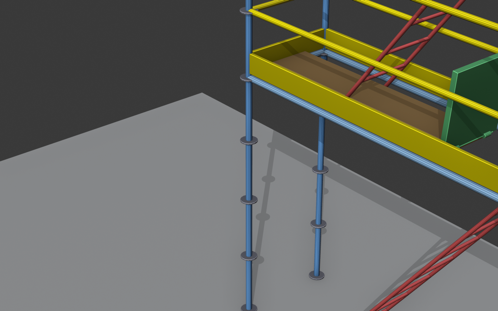 | Tramo único entre `P0` y `P1`. Sin esquinas. |
| **Andamio en L** (3 empties con un giro) | 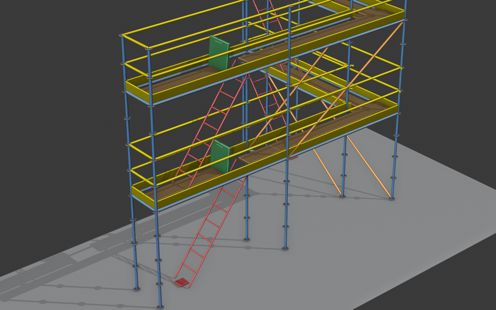 | Esquina interior con bisectriz + plataforma de esquina dedicada. |
| **Andamio en U** (4 empties, 2 esquinas) | 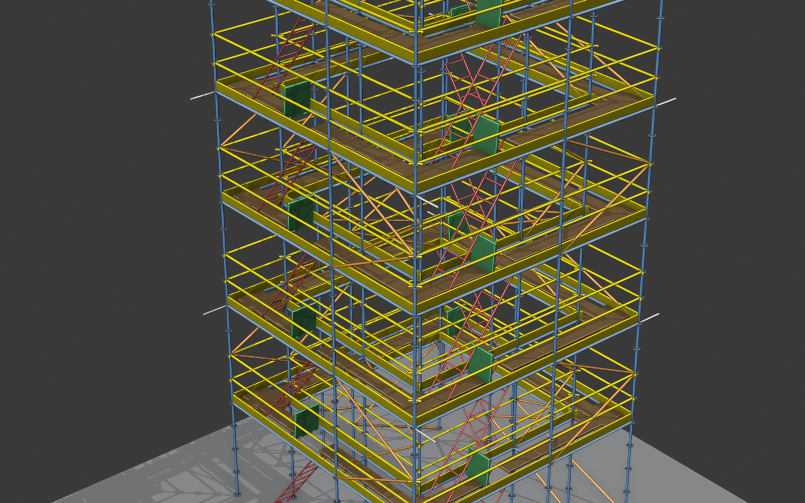 | Tres tramos rectos y dos esquinas — el caso clásico de fachada en bloque de pisos. |
| **Torre cerrada** (`closed_loop = True`) | 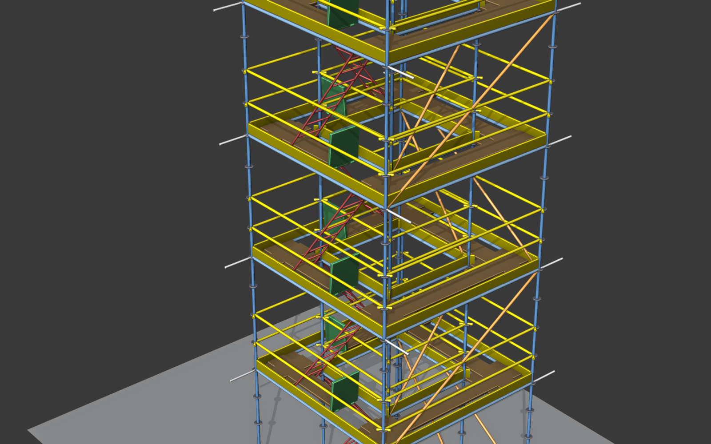 | El último punto se une al primero. Sin extremos abiertos, sin barandillas transversales. |
| **Construcción paso a paso** | 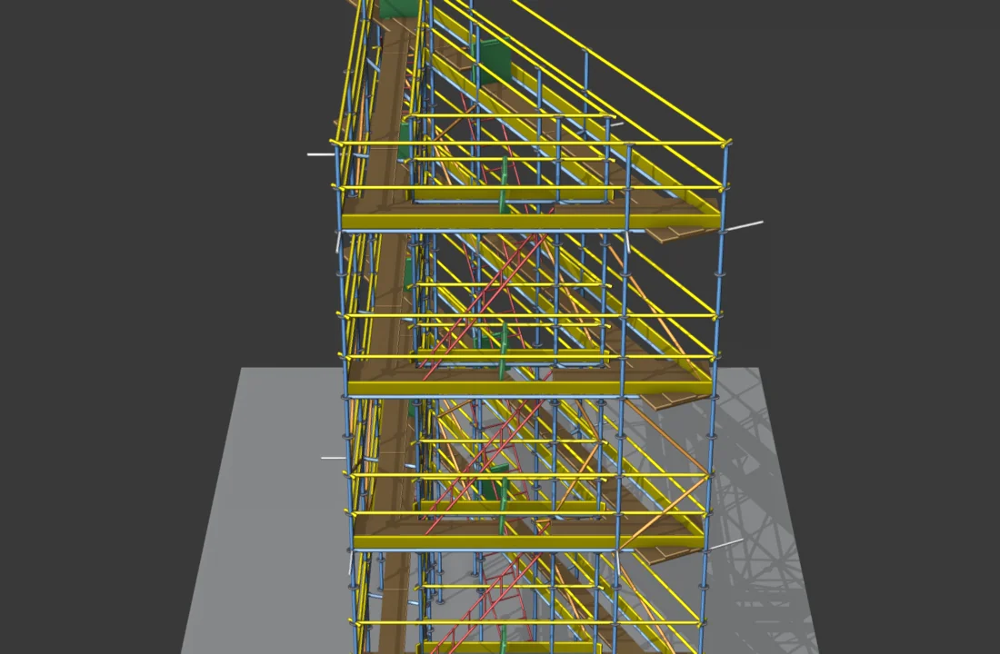 | Animación que enseña en qué orden se "monta" el andamio: postes → ledgers → bandejas → barandillas → cruces → escaleras. |

### 19.2 Variables que cambian la forma

| Concepto | Visual | Qué controla |
|---|---|---|
| **Profundidad** (`scaffold_depth`) | 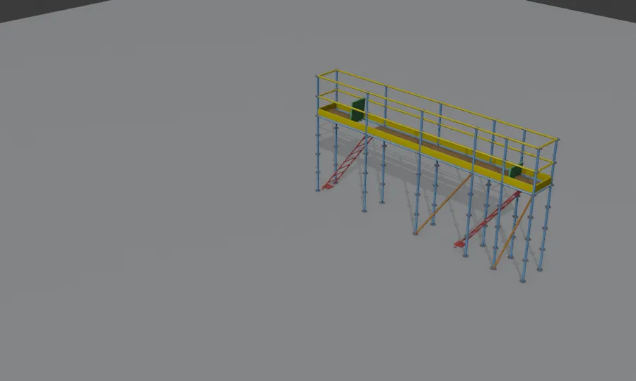 | Ancho perpendicular del andamio. La animación cicla entre 0,640 / 0,732 / 1,090 m (presets Layher). |
| **Plantas** (`floor_count`) | 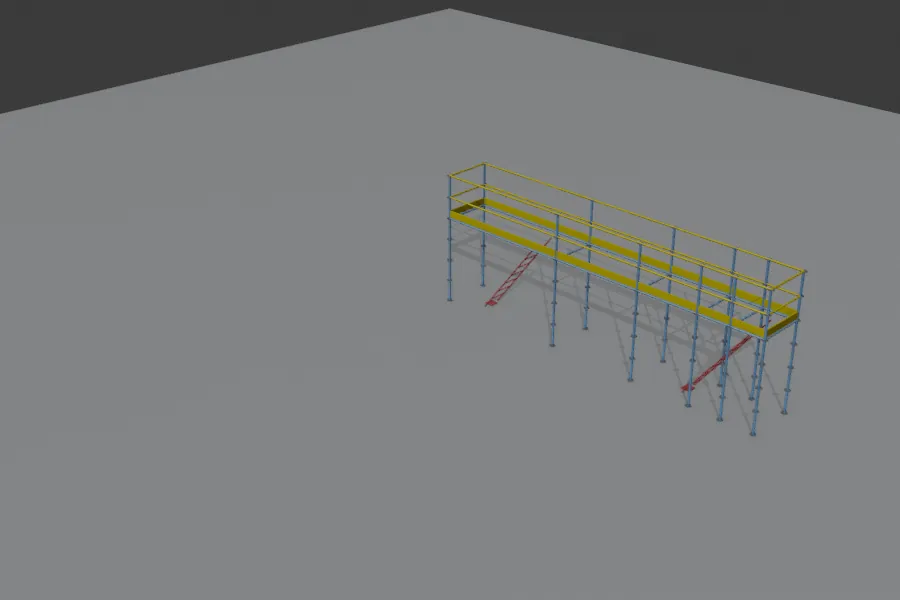 | Nº de pisos. Animación de 1 a 5 plantas. |
| **Catálogo de vanos** (`bay_length_catalog`) | 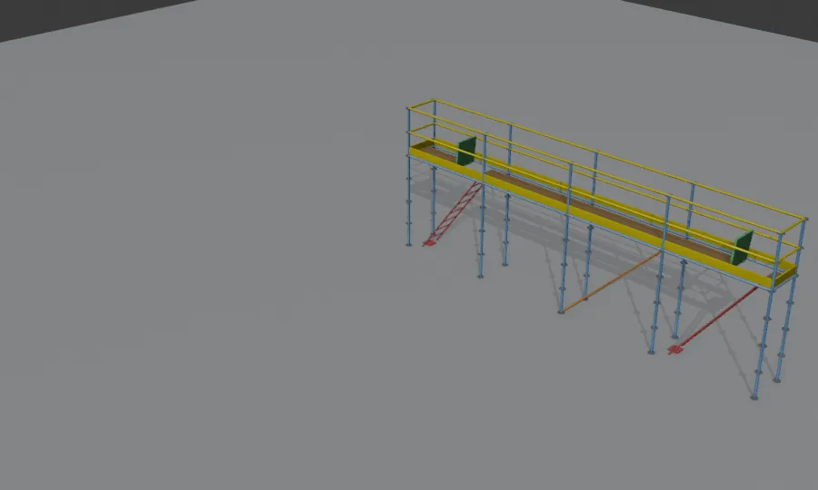 | Mixto / Layher Allround / Iguales — cambia cómo se subdivide cada tramo en bays. |

### 19.3 Cruces y arriostramiento

| Concepto | Visual | Qué hace |
|---|---|---|
| **Cruces ON / OFF** (`add_braces`) | 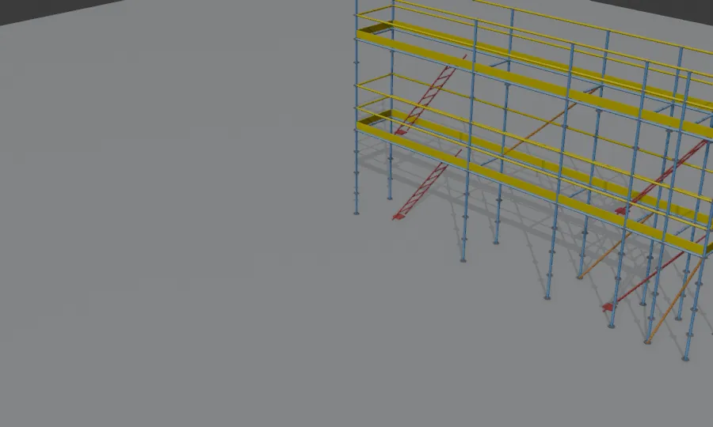 | Las cruces son las diagonales que estabilizan el andamio frente a empujes laterales. Sin ellas, el andamio se "abanica". |
| **Patrón** (`brace_pattern`) | 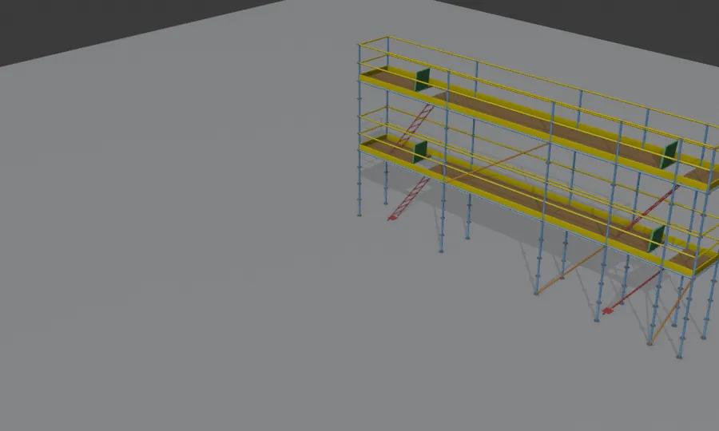 | FRONT (sólo cara exterior) / BACK (sólo interior) / BOTH (ambas) / ALT (alterna cada 4 bays). |
| **Subdivisión** (`brace_subdivision`) | 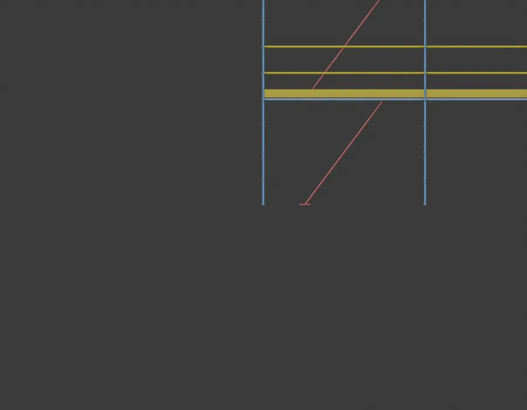 | NONE (cruz completa) / HALF (zigzag en N) / QUARTER (zigzag fino). |
| **Cruz HALF — alzado** | 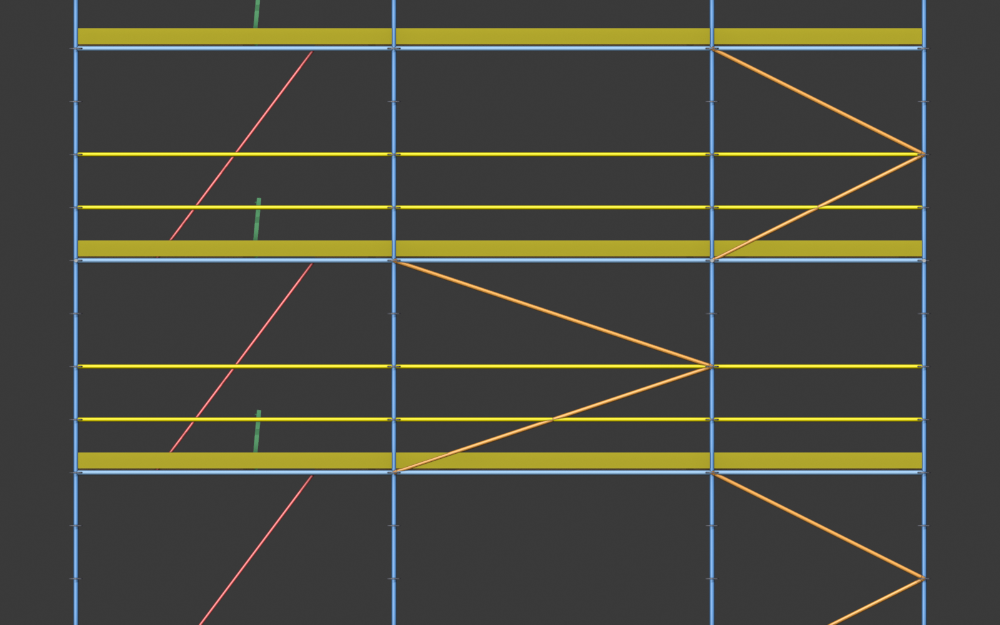 | Cómo se ven las sub-cruces a media altura. |
| **Cruz QUARTER — alzado** | 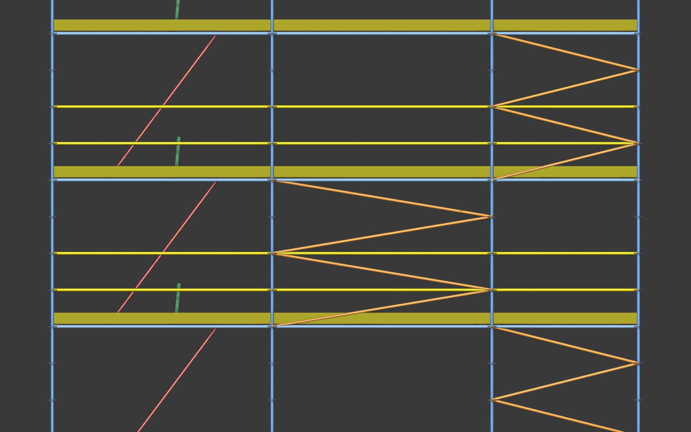 | Sub-cruces cada cuarto de altura — sólo en torres ≥ 15 m. |

### 19.4 Plataformas, escaleras, anclajes

| Concepto | Visual | Qué muestra |
|---|---|---|
| **Bandejas ON / OFF** (`add_decks`) | 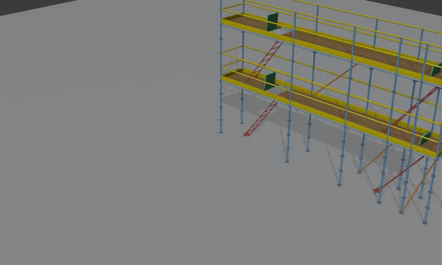 | Plataformas de servicio. Sin ellas el andamio queda como esqueleto. |
| **Escalera con trampilla** | 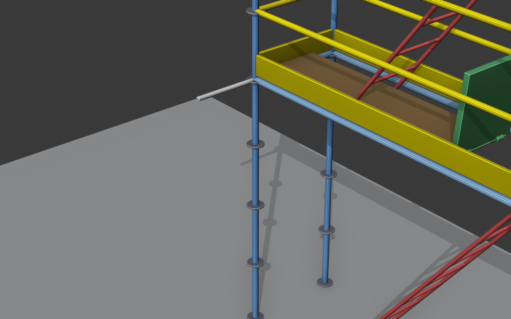 | Escalera inclinada con peldaños + tapa de acceso. La trampilla se abre hacia arriba (`lid_open_deg`). |
| **Anclajes a fachada** (`add_ties`) | 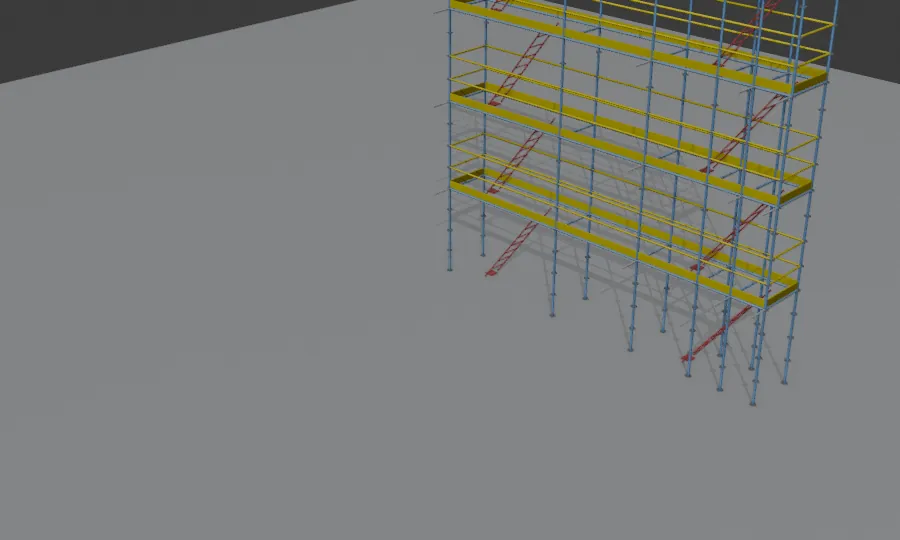 | Tubos perpendiculares que fijan el andamio al muro. Obligatorios si altura > 8 m. |
| **Ejemplo con anclajes — vista lateral** | 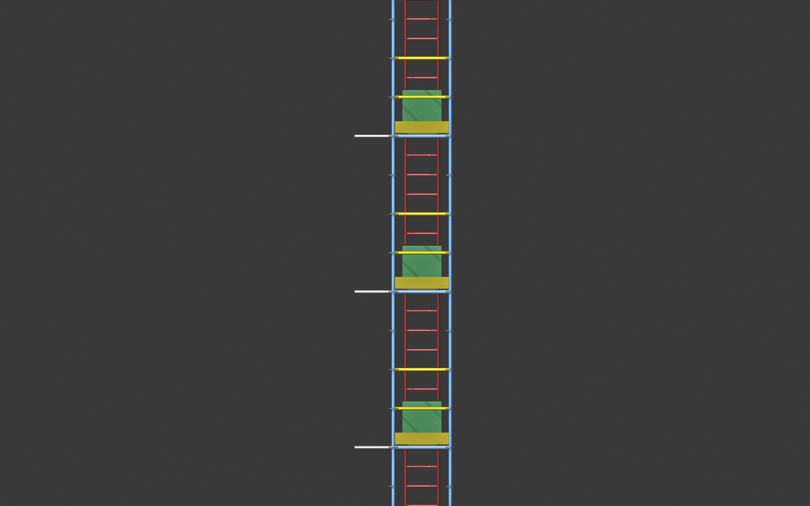 | Distribución de anclajes en altura (cada `tie_every_floors` plantas). |

### 19.5 Términos del cálculo estructural

| Término | Imagen / definición visual |
|---|---|
| **Roseta** | Disco soldado al poste con 8 agujeros (4 a 90° + 4 a 45°) por donde pasan las cuñas que sujetan ledgers, braces y ties. Es la pieza que diferencia un sistema modular tipo Layher Allround de uno tubular tradicional. Para ver una real busca "Layher Allround rosette" en cualquier buscador de imágenes. |
| **Husillo (jack base)** | Pie regulable bajo cada poste — rosca metálica que se gira para nivelar. Sin husillo el andamio se apoya en el suelo crudo y no se puede nivelar. Ver `jack_height` y `use_terrain_z`. |
| **Bay** | Cada vano horizontal entre 2 postes consecutivos. Un andamio típico de fachada de 10 m con bays Layher de 2,07 m tiene 4 bays + 1 compensador. Ver imágenes 19.1 — los bays son los rectángulos verticales del frente. |
| **Compensador** | Pieza singular de longitud no estándar que aparece **al final** de un tramo cuando el catálogo no encaja exacto. En el plano CAD se etiqueta en rojo con "compens." para distinguirla de los bays modulares. |
| **K_φ (rigidez del nudo)** | Resistencia rotacional de la unión roseta-tubo. Layher Allround real: K_φ ≈ 80 kN·m/rad. Ni rótula perfecta (K_φ = 0) ni empotramiento rígido (K_φ = ∞), un punto medio. Mayor K_φ → menos pandeo en los postes. |
| **Utilización** | Fracción de la capacidad del miembro que está usándose. `0,55` = está al 55% de su límite (verde). `0,90` = al 90% (ámbar). `1,15` = sobrepasado en 15% (rojo, no cumple). En el viewport el coloreado por utilización usa esta misma escala. |

---

## ¿Algo no funciona?

1. Mira los **logs de la consola** de Blender (`Window → Toggle System Console`).
2. Exporta el **informe de diagnóstico** (§17).
3. Comparte ambos en el issue tracker o por email.

¡Buena suerte montando andamios virtuales!
